# Referral System API

A comprehensive referral and credit management system built for course marketplace platforms. This system tracks user referrals, manages credit rewards, and handles order processing with automated referral conversions.

## 📋 Table of Contents

- [Features](#features)
- [System Architecture](#system-architecture)
- [Database Schema](#database-schema)
- [Getting Started](#getting-started)
- [API Documentation](#api-documentation)
- [Referral Flow](#referral-flow)
- [Business Logic](#business-logic)
- [Environment Variables](#environment-variables)
- [Installation](#installation)

## ✨ Features

- **User Referral System**: Generate and share unique referral codes
- **Automated Credit Management**: Automatic credit allocation on successful conversions
- **First Purchase Detection**: Smart detection of first-time purchases for referral conversion
- **Referral Analytics**: Track referred users, conversions, and total credits earned
- **Role-Based Access Control**: Super Admin privileges for course management
- **Order Processing**: Complete order management with referral integration

## 🏗️ System Architecture

### UML Diagram

The following diagram illustrates the complete user flow and system interactions:



**Key Flows:**

1. **User Signup**: With/without referral code
2. **Course Purchase**: Three scenarios based on order history
3. **Admin Actions**: Course creation/deletion (Super Admin only)
4. **Stats Calculation**: Real-time analytics from Referral table

### Database Schema

The ER diagram shows all entities and their relationships:


**Core Entities:**

- `user`: User accounts with referral codes
- `referral`: Tracks referral relationships and status
- `order`: Purchase records
- `course`: Course catalog
- `credit_activity`: Credit transaction history

## 🚀 Getting Started

### Prerequisites

- Node.js >= 22.x
- MongoDB >= 8.x
- npm or yarn

### Installation

```bash
# Clone the repository
git clone <repository-url>

# Install dependencies
npm install

# Set up environment variables
cp .env.example .env

# Start the server
npm start
```

The API will be available at `http://localhost:3000`

## 📚 API Documentation

Interactive API documentation is available via Swagger UI:

**Swagger Docs**: [http://localhost:3000/api-docs](http://localhost:3000/api-docs)

## 🔄 Referral Flow

### 1. User Registration with Referral Code

```
User signs up with referral code
    ↓
System validates referral code
    ↓
Create User account
    ↓
Create Referral entry (status: "pending")
```

**Result**: New user linked to referrer, awaiting first purchase

### 2. First Purchase (Referral Conversion)

```
User makes first purchase
    ↓
System checks: Is this first order? Has referred_by?
    ↓
Create Order
    ↓
Update Referral status: "pending" → "converted"
    ↓
Create Credit Activity record
```

**Result**: Referrer receives credits, referral marked as converted

### 3. Subsequent Purchases

```
User makes another purchase
    ↓
System checks: Is this first order? → NO
    ↓
Create Order only
```

**Result**: No referral update, no additional credits

## 💼 Business Logic

### Referral Status

| Status      | Description                                              |
| ----------- | -------------------------------------------------------- |
| `pending`   | User signed up via referral but hasn't made a purchase   |
| `converted` | User completed first purchase, referrer received credits |

### Credit Allocation Rules

1. **First Purchase Only**: Credits awarded only on the referred user's first order
2. **One-Time Conversion**: Referral status changes from `pending` to `converted` once
3. **No Retroactive Credits**: Subsequent purchases don't generate additional credits

### Role-Based Permissions

| Action              | User | Super Admin |
| ------------------- | ---- | ----------- |
| Sign up             | ✅   | ✅          |
| Purchase course     | ✅   | ✅          |
| View referral stats | ✅   | ✅          |
| Create course       | ❌   | ✅          |
| Delete course       | ❌   | ✅          |

## 📊 Referral Statistics

All statistics are calculated from the `referral` table:

```javascript
{
  "referredUsers": 10,        // Total count of referrals
  "convertedUsers": 4,         // Count where status = "converted"
  "totalCreditsEarned": 8      // Sum of all credits earned
}
```

## 🔐 Environment Variables

```env
# Server Configuration
PORT=3000
NODE_ENV=development

# Database
DATABASE_URL=database_url

# JWT Configuration
JWT_SECRET=your_jwt_secret_key
JWT_EXPIRES_IN=5m
JWT_REFRESH_SECRET=your_jwt_secret_key
JWT_REFRESH_EXPIRES_IN=7d

# Bcript
BCRYPT_SALT_ROUNDS=10

```

## 📦 Installation

```bash
# Clone the repository
git clone https://github.com/tusharahmmed/referral-server.git

# Navigate to project directory
cd referral-server

# Install dependencies
yarn install

# Copy environment variables
cp .env.example .env

# Configure your .env file with database and other settings

# Start development server
yarn dev

# Or start production server
yarn start
```

**Built with ❤️ using Node.js, Express, Typescript and Mongoose**
